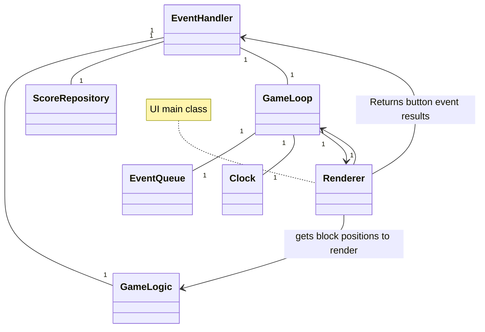
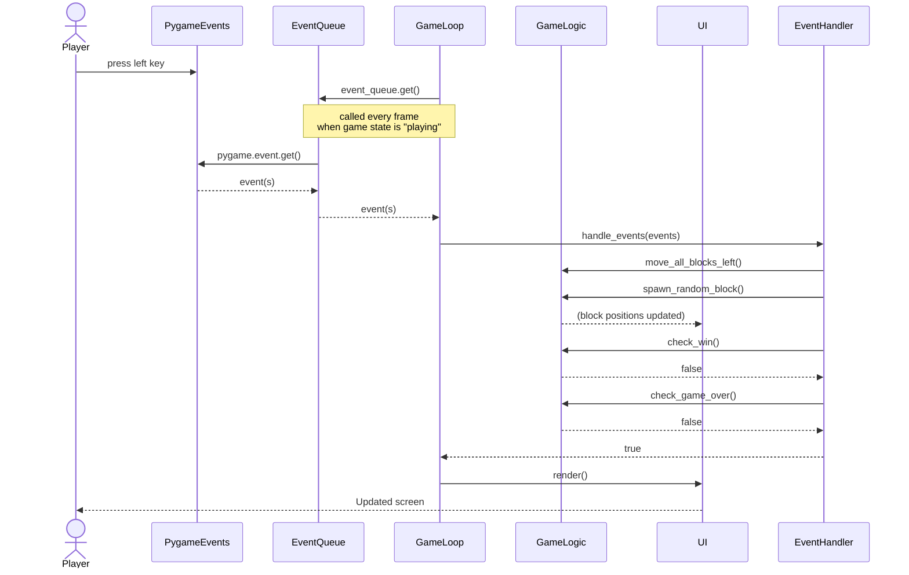
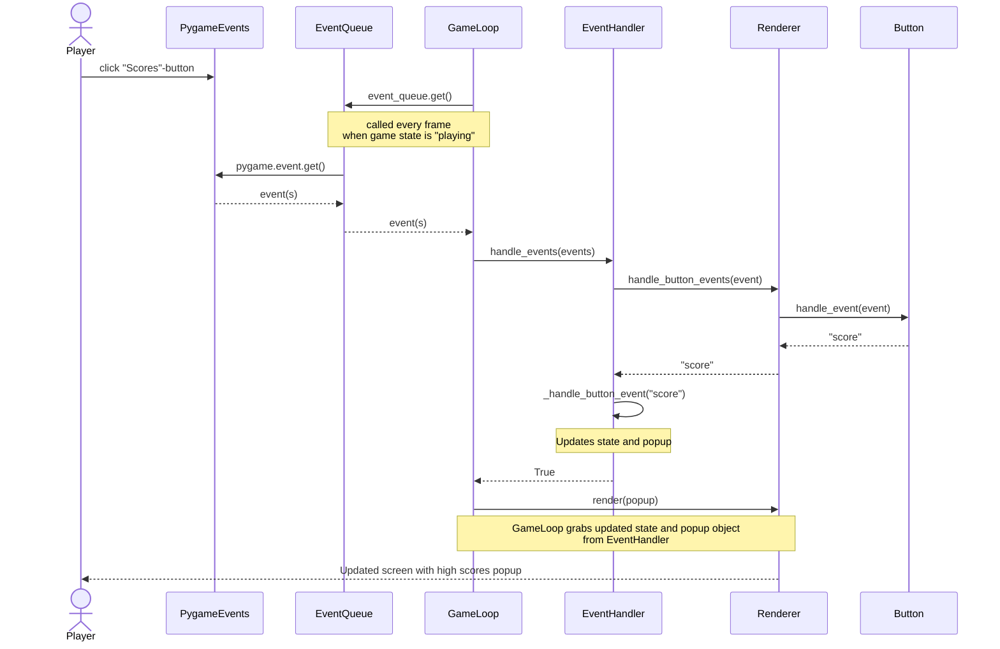

# Arkkitehtuuri
## Rakenne
Pelin yleistason rakennetta ja yhteyksiä havainnollistaa seuraava luokkakaavio:

- `GameLogic` sisältää pelin logiikan ja tilan.
- `GameLoop` vastaa pelisilmukan pyörityksestä.
- `EventHandler` käsittelee käyttäjän syötteet ja vastaa popup-ikkunoiden tilan hallinnasta.
- `Renderer` vastaa pelin ja popup-ikkunoiden piirtämisestä ruudulle.
- `ScoreRepository` huolehtii tulosten tallennuksesta ja hakemisesta.
- `Clock` wrapper pygamen kellolle.
- `EventQueue` hakee pygame tapahtumat.
  
## Sovelluslogiikka
Peli käynnistetään `GameLoop`-luokan `run()` metodilla, jossa se pyörii silmukassa. 

Pelin päälogiikka ja tila sijaitsee `GameLogic`-luokassa. Pelaajan syötteet, kuten nuolinappien painallukset, prosessoidaan `EventHandler`-luokassa ja delegoidaan `GameLogic`-luokalle, joka huolehtii laattojen siirroista, pisteiden laskennasta sekä voitto- ja häviötilanteiden tarkituksesta. `EventHandler` huolehtii myös popup-ruutujen, kuten voitto- ja pistenäkymien tilan hallinnasta.

`Renderer`-luokka vastaa pelin piirtämisestä näytölle, ja päänäkymän nappien painalluksien palautusarvoista `EventHandler`-luokalle. Se hakee laattojen sijainnit ja muut tila arvot `GameLogic`-luokalta ja renderöi ne ruudulle. `Renderer`-luokka vastaa myös popup-ikkunoiden renderöinnistä, mutta näiden ikkunoiden nappien palautusarvojen vastuu on popup-ikkunaa vastaavalla `PopupScreen`-luokan aliluokalla.

Pisteiden pysyväistallennuksesta ja lukemisesta vastaa `ScoreRepository`, joka tallentaa pisteet pelin loputtua tai kun pisteikkuna avataan.

## Päätoiminnallisuudet
### Laattojen liu'uttaminen
Oletetaan, että peli on alustettu ja käynnistetty. Pelaajan painaessa peliruudussa ollessaan vasenta nuolinäppäintä, ja pelin jatkuessa tämän jälkeen, toimii sovelluksen logiikka sekvenssikaavion mukaan:

### Päänäkymän painikkeiden toiminta
Käytännössä jokaisen päänäkymän painikkeen klikkaus toimii samalla logiikalla. Seuraavassa kaaviossa esitetään ohjelman toiminta, kun käyttäjä painaa "Scores"-painiketta. Kaaviossa UI-komponentteja ovat `Renderer` ja `Button`.

Jokaisella painikkella on `command`-atribuutti, joka määrittää, mitä `Button`-olio palauttaa, kun sen `hande_event`-metodia kutsutaan. Jos klikkauksen sijainti osuu painikkeen alueelle, palauttaa painike merkkijonon `command`-atribuuttin mukaan `Renderer`-oliolle, joka välittää sen edelleen `EventHandler`-oliolle. Painikkeet eivät siis itse muuta pelin tilaa suoraan, vaan varsinainen tapahtumankäsittely tehdään palautettujen arvojen perusteella `EventHandler`-luokassa. `EventHandler` muuttaa palautusarvojen perusteella omaa tilaansa, ja `GameLoop` hakee nämä tilan muutokset siltä.
