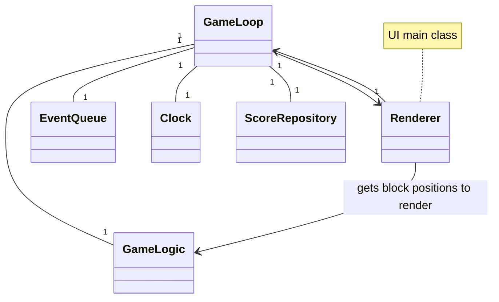
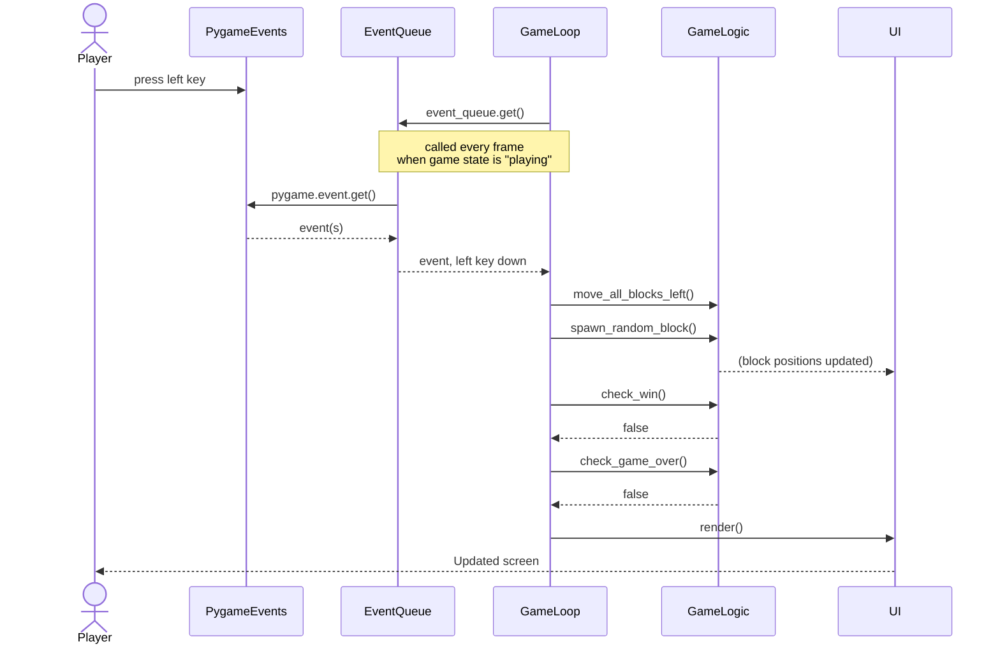

## Alustava rakenne

## Päätoiminnallisuudet
### Laattojen liu'uttaminen
Oletetaan, että peli on alustettu ja käynnistetty. Pelaajan painaessa peliruudussa ollessaan vasenta nuolinäppäintä, ja pelin jatkuessa tämän jälkeen, toimii sovelluksen logiikka sekvenssikaavion mukaan:

