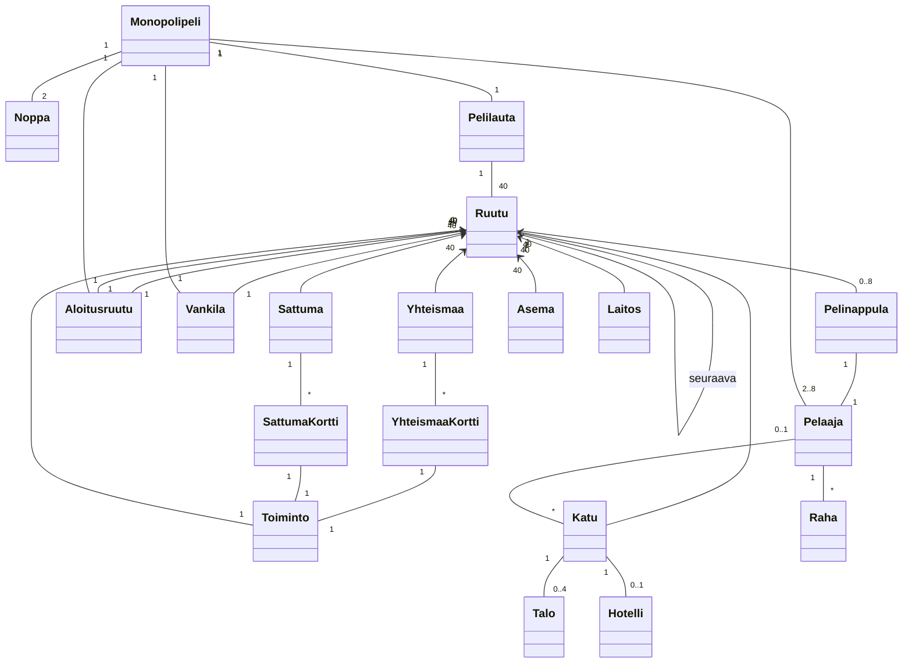

```mermaid
 classDiagram
    Monopolipeli "1" -- "2" Noppa
    Monopolipeli "1" -- "1" Pelilauta
    Pelilauta "1" -- "40" Ruutu
    Ruutu "1" -- "1" Ruutu : seuraava
    Ruutu "1" -- "0..8" Pelinappula
    Pelinappula "1" -- "1" Pelaaja
    Pelaaja "2..8" -- "1" Monopolipeli

    Ruutu "40" <-- "1" Aloitusruutu
    Ruutu "40" <-- "1" Vankila
    Ruutu "40" <-- "1" Aloitusruutu
    Ruutu "40" <-- Sattuma
    Ruutu "40" <-- Yhteismaa
    Ruutu "40" <-- Asema
    Ruutu "40" <-- Laitos

    Yhteismaa "1" -- "*" YhteismaaKortti
    YhteismaaKortti "1" -- "1" Toiminto

    Sattuma "1" -- "*" SattumaKortti
    SattumaKortti "1" -- "1" Toiminto

    Ruutu "40" <-- Katu
    Katu "1" -- "0..4" Talo
    Katu "1" -- "0..1" Hotelli
    Pelaaja "0..1" -- "*" Katu

    Ruutu "1" -- "1" Toiminto

    Monopolipeli "1" -- "1" Aloitusruutu
    Monopolipeli "1" -- "1" Vankila

    Pelaaja "1" -- "*" Raha
```
